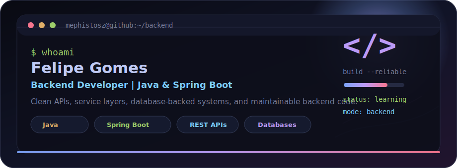

<h1 align="center">Felipe Gomes</h1>

<p align="center">
  <strong>Backend Developer | Java & Spring Boot</strong>
</p>

<p align="center">
  Building clean APIs, database-driven services, and maintainable backend systems.
</p>

<div align="center">
  
</div>

<br />

```bash
mephistosz@github:~$ whoami
Backend developer focused on Java, Spring Boot, REST APIs, and persistence layers.
```

## ~/about

- I work with backend development and practical software problem solving
- I like clean service layers, readable APIs, and database-backed applications
- I am currently sharpening my Java, Spring Boot, and backend architecture skills
- I care about code that is simple to understand, debug, and maintain

## ~/currently

- Designing and implementing REST APIs
- Building stronger Java and Spring Boot foundations
- Working with relational and NoSQL persistence
- Improving debugging, delivery, and Git workflow consistency

## ~/toolbox

<p align="left">
  
  
  
  
  
  
  
</p>

## ~/principles

- Keep systems readable before they become clever
- Prefer maintainable solutions over unnecessary complexity
- Debug from evidence, not guesses
- Build backend code that other developers can safely change

## ~/metrics

<p align="center">
  
</p>

## ~/contact

```text
Open to backend developer opportunities.
Email: felipe.gomes.fg877@gmail.com
```
